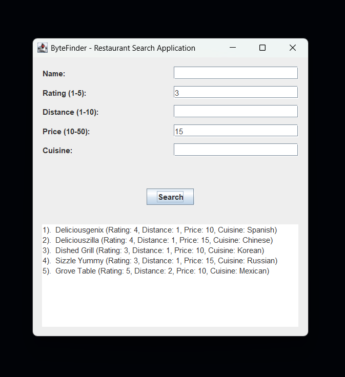

# 🍽️ ByteFinder – Restaurant Search Application

**ByteFinder** is a Java application that allows users to search for restaurants based on several 
filters such as name, rating, distance, price, and cuisine type.

It includes both:
- a **search engine** (`RestaurantSearch.java`) that performs the filtering and sorting logic, and
- a **desktop GUI** (`RestaurantUI.java`) built using **Java Swing**.

---

## 📁️ Project Structure
- `ByteFinder/`
    - `csv/`
        - `restaurants.csv`      Restaurant dataset 
                                (`name`, `customer_rating`, `distance`, `price`, `cuisine_id`)
        - `cuisines.csv`         Cuisine dataset (`id`, `name`)
    - `Restaurant.java`          Base restaurant object with attributes
    - `RestaurantSearch.java`    Core search logic and CSV loading
    - `RestaurantUI.java`        Swing-based user interface (main program)
    - `bytefinder_ui.png`        Example screenshot of the running GUI
    - `README.md`                Project documentation

---

## 📊 Example Data Format
`restaurants.csv`
```
name,customer_rating,distance,price,cuisine_id
Deliciousgenix,4,1,10,11
Herbed Delicious,4,7,20,9
Deliciousscape,3,7,50,1
```
\
`cuisines.csv`
```
id,name
1,American
2,Chinese
3,Thai
```

---

## 🧩 Program Components

### 1. `Restaurant.java`
Defines the **data model** for restaurant entries.

Handles:
- Representing a restaurant’s attributes (`name`, `rating`, `distance`, `price`, `cuisine`)
- Providing a readable `toString()` output for display
- Serving as the core object used throughout the search and UI layers

### 2. `RestaurantSearch.java`
Implements the **core logic and data handling**.

Handles:
- Loading and parsing `restaurants.csv` and `cuisines.csv`
- Mapping cuisine IDs to human-readable cuisine names
- Validating user input parameters (rating, distance, price)
- Filtering restaurants based on:
    - Partial, case-insensitive name/cuisine matches
    - Minimum rating, maximum distance, and maximum price
- Sorting results by:
    1. **Distance** (ascending)
    2. **Rating** (descending)
    3. **Price** (ascending)
- Returning the top 5 best-matched restaurants

### 3. `RestaurantUI.java`
Provides the graphical user interface using Java Swing.

Implements:
- Input fields for name, rating, distance, price, and cuisine
- A “Search” button that triggers the query
- A scrollable results area to display matches
- Error handling and input validation through dialog boxes
- A clean, organized layout with intuitive controls


---

## ⚙️ How to Compile / Run

### **Option 1: Using Command Line**

1. Clone the project repository.
2. Make sure you have a Java JDK installed.
3. Navigate to the project directory:
    ```
    cd ByteFinder
    ```
4. Compile the source files:
    ```
    javac Restaurant.java RestaurantSearch.java RestaurantUI.java
    ```
5. Run the main UI program:
    ```
    java RestaurantUI
    ```

This will launch the ByteFinder search window.

### Option 2: Using an IDE (Recommended)

1. Clone the project repository.
2. Make sure you have a Java JDK installed.
3. Open the project folder in IntelliJ, Eclipse, or VS Code (Java Extension). 
4. Make sure your directory structure matches the one above. 
5. Set the working directory to the folder that contains the csv/ folder. 
6. Run the class **RestaurantUI** — this is the application entry point.

---

## 🧭 How to Test the Application

1. Launch the UI (either via IDE or `java RestaurantUI`). 
2. Enter any combination of the following fields:
   - **Name**: Partial or full name of a restaurant. 
   - **Rating**: Minimum acceptable customer rating (1–5 whole numbers only). 
   - **Distance**: Maximum acceptable distance in miles (1–10 whole numbers only). 
   - **Price**: Maximum acceptable price per person (10–50 whole numbers only). 
   - **Cuisine**: Partial or full cuisine name (e.g., “Chinese”, “Italian”).
3. Click the `“Search”` button. 
4. Results will appear in the text area below — up to 5 matches are shown, sorted by:
   - **Distance** (ascending)
   - **Rating** (descending)
   - **Price** (ascending)

If no restaurants match the criteria, “No matches found.” will be displayed. \
If no criteria were provided, then the `5 best matches` are returned based on the
distance-rating-price sorting rule.

### Example Test Case with Explanation

### Inputs:
`Rating = 3` \
`Price = 15`

### Outputs:
`1).  Deliciousgenix (Rating: 4, Distance: 1, Price: 10, Cuisine: Spanish)` \
`2).  Deliciouszilla (Rating: 4, Distance: 1, Price: 15, Cuisine: Chinese)` \
`3).  Dished Grill (Rating: 3, Distance: 1, Price: 10, Cuisine: Korean)` \
`4).  Sizzle Yummy (Rating: 3, Distance: 1, Price: 15, Cuisine: Russian)` \
`5).  Grove Table (Rating: 5, Distance: 2, Price: 10, Cuisine: Mexican)`

### Explanation:
### 1. Filter step:
Only restaurants with a `rating ≥ 3` and `price ≤ 15` remain.

Others (e.g., too expensive or low-rated) are excluded.

### 2. Sorting step:

First by distance (ascending) → closer restaurants are preferred.

Then by rating (descending) → higher-rated restaurants are preferred if distances are equal.

Then by price (ascending) → cheaper restaurants break ties.

### 3. Limiting step:

Only the top `5` after sorting are shown.

### 4. Result reasoning:

Four restaurants tied for being the nearest.

**Deliciousgenix** ranked highest because it’s the closest (1), highest-rated (4), and cheapest (10).

**Sizzle Yummy** lost to **Dished Grill**, after being tied for distance (1) and rating (3), 
being just being slightly pricier (15).

**Grove Table** ranked fifth even though it was highest-rate (5), it was slightly farther away.

---

## 🧠 Filtering & Sorting Rules
### Filters
| **Field**  | **Rule**                              |
|-------------|----------------------------------------|
| Name        | Partial match (case-insensitive)       |
| Rating      | Restaurant rating ≥ input              |
| Distance    | Restaurant distance ≤ input            |
| Price       | Restaurant price ≤ input               |
| Cuisine     | Partial match (case-insensitive)       |

All filters are combined using **AND** logic.

### Sorting Priority:
1. Distance (ascending)
2. Rating (descending)
3. Price (ascending)
4. Random (if all above are equal)

---

## ✅ Assumptions Made

### 1. CSV Format:
Both `restaurants.csv` and `cuisines.csv` include headers and use commas as delimiters.

### 2. Cuisine Mapping:
Every **cuisine_id** in `restaurants.csv` is expected to exist in `cuisines.csv`.
If not, the cuisine is labeled "Other".

### 3. Validation:
- Name: Case-insensitive String match
- Rating: 1–5 (Whole numbers)
- Distance: 1–10 (Whole numbers)
- Price: 10–50 (Whole numbers)
- Cuisine: Case-insensitive String match

### 4. File Paths:
The program assumes the CSV files are located in a subdirectory named `csv/`
at the same level as the `.java` files.

### 5. Output Limit:
The search always returns a maximum of 5 restaurants.

--- 

## ⚠️ Ambiguities / Clarifications

### 1. String Matching for Name/Cuisine:
Not sure whether the Restaurant Name and Cuisine inputs needed
to be case-sensitive match (went with case-insensitive).

### 2. Number Input for Rating/Distance/Price:
Not sure if user can input decimal values (went with integer inputs only).

### 3. Tie-Breaking:
When two restaurants are identical in distance, rating, and price,
order is arbitrary (left to the Java stream sorting behavior).

### 4. Malformed CSV Rows:
Rows missing required fields are skipped silently.

--- 

## 🧱 Future Enhancements

- Add range filtering (e.g., minPrice/maxPrice)
- Allow multiple cuisine selections
- Export search results to CSV or PDF
- Improve UI styling
- Introduce database integration (replace CSV with SQL or JSON backend)

--- 

## 🧪 Troubleshooting

| **Issue**                                           | **Cause**                         | **Fix**                                                                                        |
|-----------------------------------------------------|-----------------------------------|------------------------------------------------------------------------------------------------|
| Error loading data: `csv/restaurants.csv not found` | Working directory incorrect       | Ensure `csv/` folder is in the same directory as your `.java` files                            |
| Error messages                                      | Invalid number in CSV/input field | Leave the field empty, enter valid integers within range, or check CSV file for malformed data |
| No results appear                                   | Filters too strict                | Try clearing some filters                                                                      |
| Missing row entry even though exists in CSV         | CSV has missing/invalid values    | Verify your CSV data formatting                                                                |

---

## 📸 Example Screenshot



---

## 👨‍💻 Author - Steven Jiang

Developed as part of a technical assessment project. \
Implements clean OOP design, functional programming with Java Streams, and a simple GUI interface.
